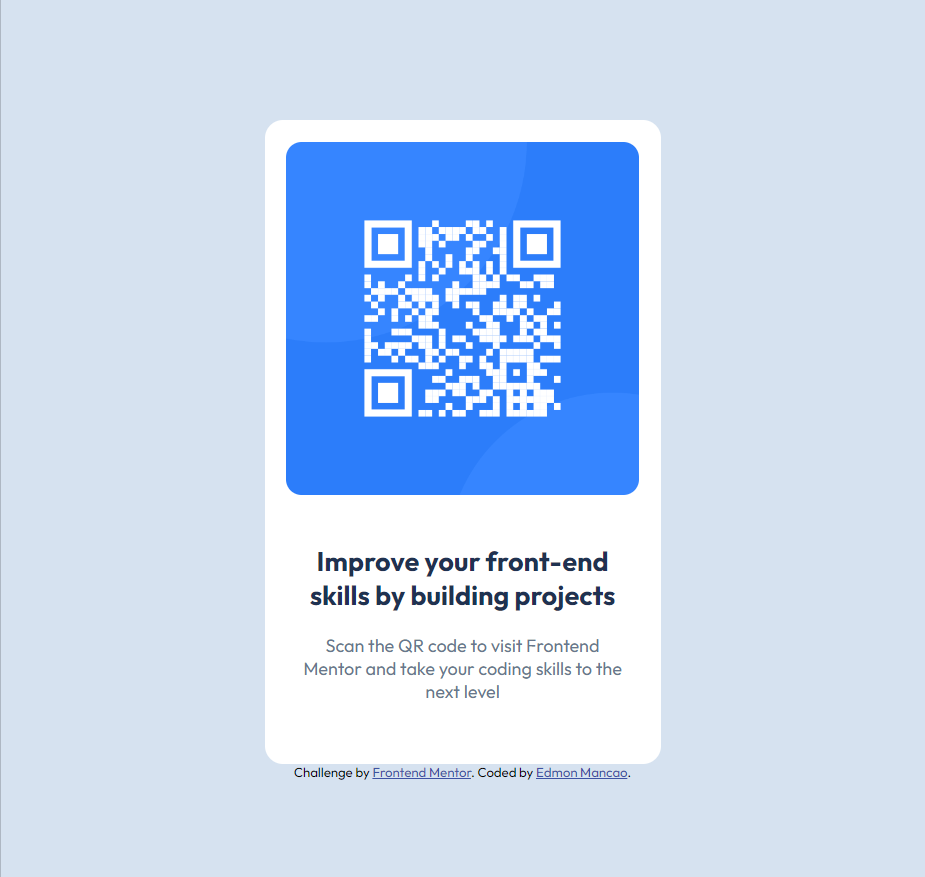
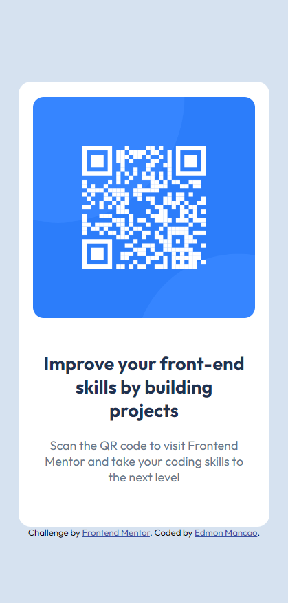

# Frontend Mentor - QR code component solution

This is a solution to the [QR code component challenge on Frontend Mentor](https://www.frontendmentor.io/challenges/qr-code-component-iux_sIO_H). Frontend Mentor challenges help you improve your coding skills by building realistic projects. 

## Table of contents

- [Overview](#overview)
  - [Screenshot](#screenshot)
  - [Links](#links)
- [My process](#my-process)
  - [Built with](#built-with)
  - [What I learned](#what-i-learned)
  - [Continued development](#continued-development)
  - [Useful resources](#useful-resources)
- [Author](#author)
- [Acknowledgments](#acknowledgments)


## Overview

### Screenshot





### Links

- Solution URL: [Add solution URL here](https://your-solution-url.com)
- Live Site URL: [Add live site URL here](https://your-live-site-url.com)

## My process

### Built with

- Semantic HTML5 markup
- CSS custom properties
- Flexbox

### What I learned

In this challenge, I learned how to structure the layout by separating elements using the `<div>` tag and assigning them appropriate class names. Specifically, I wrapped elements inside a `.container` and divided them into `.card` and `.text` sections to maintain a clean structure.

Here’s my HTML structure:


```html
<div class="container">
    <div class="card">
      
      <div class="text">
        <h2>Improve your front-end skills by building projects</h2>
        <p>Scan the QR code to visit Frontend Mentor and take your coding skills to the next level</p>
      </div>
    </div>
  </div>
```
When working with **HTML structure**, wrapping and dividing content using <div> tags is crucial. However, **styling it with CSS** can be more challenging, especially when centering the card and making it responsive using **Flexbox**.

One of the key challenges was using **Flexbox** to align the card in the center and ensuring the layout remains responsive when the page shrinks. Here’s my **CSS solution**:
```css
/* Styled by "Edmon Mancao" */

@import url('https://fonts.googleapis.com/css2?family=Outfit:wght@100..900&display=swap');

:root {
    --white : hsl(0, 0%, 100%);
    --slate300: hsl(212, 45%, 89%);
    --slate500: hsl(216, 15%, 48%);
    --slate900: hsl(218, 44%, 22%);
}

body {
    font-size: 15px;
    font-family: "Outfit", sans-serif;
    background-color: var(--slate300);
    min-height: 100vh;
    display: flex;
    flex-direction: column;
    justify-content: center;
    align-items: center;
}

/* The container size */
.container {
    max-width: 360px;
    margin: 0 auto;
}

.card {
    background-color: var(--white);
    padding: 18px;
    border-radius: 15px;
    text-align: center;
    margin: 0 1em
}

/* Style for img */
.card img {
    width: 100%;
    border-radius: 13px;
}

.text {
    padding: 18px 10px;
}

.text h2 {
    color: var(--slate900);
}

.text p {
    color: var(--slate500);
}
```

Overall, this challenge helped me understand **structuring HTML properly** and **using CSS flexbox** to achieve a centered, responsive design. I wanted to share my experience here to help others working on similar projects. 🚀


### Continued development

Here, in this group. I want to learn more when it comes of development.

### Useful resources

- [Youtube: Flexbox](https://www.youtube.com/watch?v=wsTv9y931o8&t=23s) - This helped me to know more about Flexbox in web development world.

- [MDN: CSS Variable](https://developer.mozilla.org/en-US/docs/Web/CSS/Using_CSS_custom_properties) - This helped me for creating variable in CSS using `:root` to set their names and values using the colors.


## Author

- Frontend Mentor - [@mancsedmon29](https://www.frontendmentor.io/profile/mancsedmon29)
- LinkedIn - [@Edmon Mancao](https://www.linkedin.com/in/edmon-mancao-789093228/)


## Acknowledgments

I would like to express my gratitude to **Frontend Mentor** for providing this challenge, which helped me enhance my front-end development skills. This project allowed me to practice structuring HTML elements, implementing CSS flexbox for alignment, and improving responsiveness.

Additionally, I appreciate the **support from online coding resources** and tutorials that guided me in refining my CSS styling techniques. This project has been a great learning experience, and I look forward to building more projects to improve my skills.
